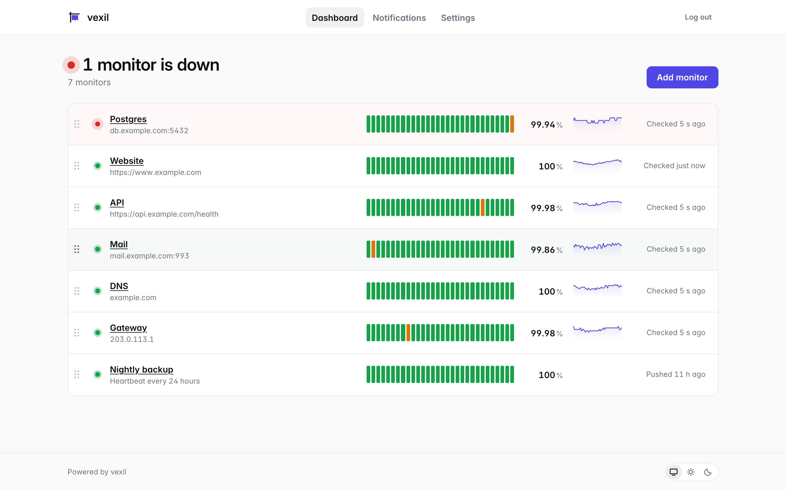
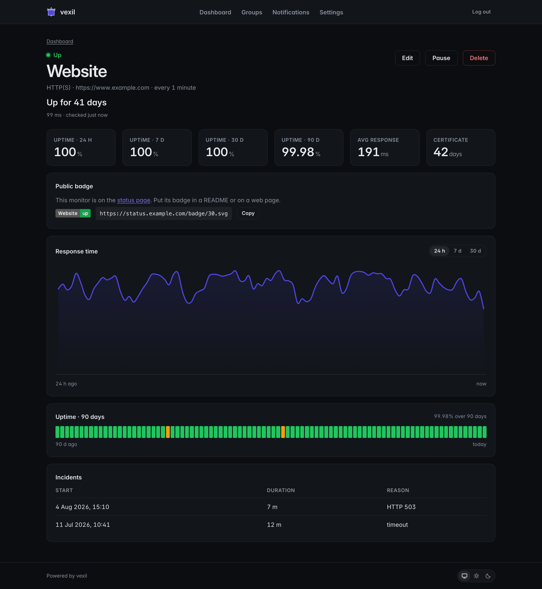
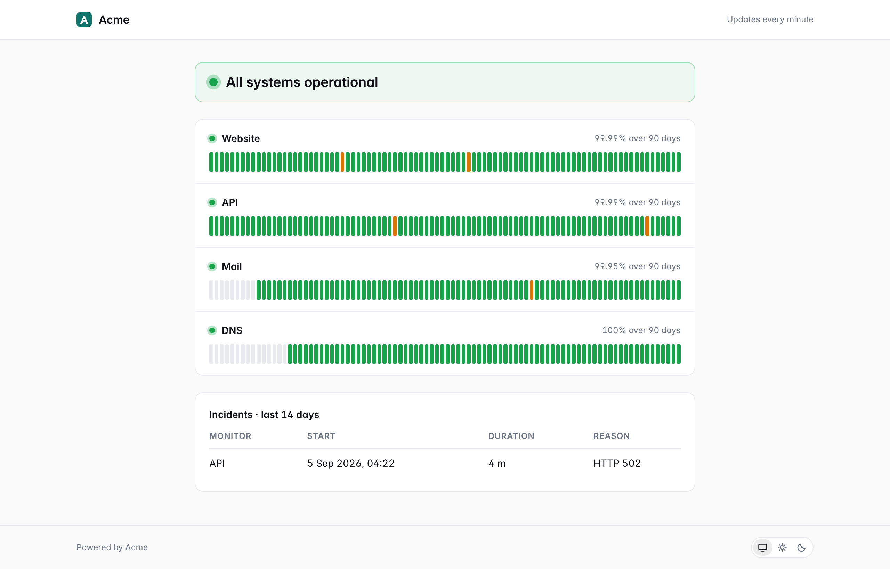
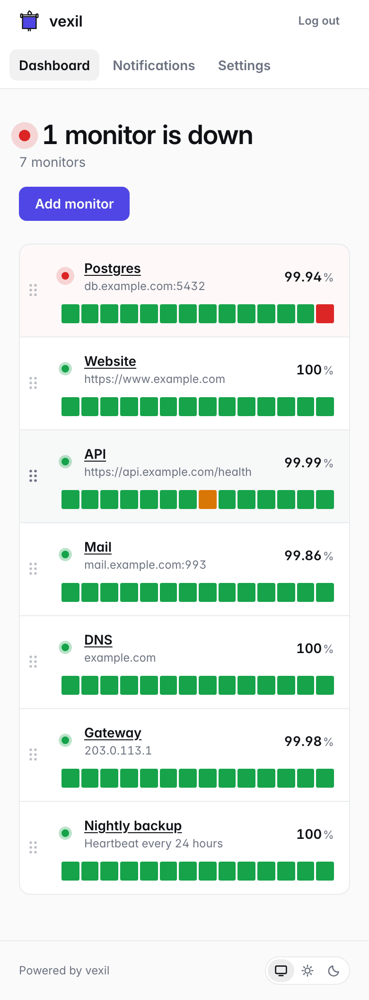

# vexil

vexil is a simple, self-hosted uptime monitor. One binary, one data folder, no external database.

- Monitors HTTP, TCP, ping, DNS and push targets.
- Sends alerts to email, Slack, Discord, Telegram, ntfy, Pushover and webhooks.
- Serves a public status page and status badges.
- Groups monitors under headings on the dashboard and on the status page.
- Runs as one static Go binary with SQLite inside the data folder.

## Screenshots

The dashboard in the light theme:



A monitor in the dark theme, with the response chart, uptime and incidents:



The public status page with a custom name and logo:



The dashboard on a phone:



## Quick start

Download the archive for your system from the [releases page](https://github.com/InAtTheGeekEnd/vexil/releases), extract it, and run the binary:

```
tar -xzf vexil_*_linux_amd64.tar.gz
./vexil
```

On Windows, unzip the archive and run `vexil.exe`.

Or build it from source. You need Go 1.27 or later:

```
git clone https://github.com/InAtTheGeekEnd/vexil.git
cd vexil
go run ./cmd/vexil
```

Open http://localhost:8080. On the first visit vexil asks you to set the admin password.

vexil creates a `data` folder in the current directory. It holds the database and any uploaded logo.

### Docker

```
docker run -d --name vexil -p 8080:8080 -v vexil-data:/data \
  --sysctl net.ipv4.ping_group_range="0 2147483647" \
  ghcr.io/inatthegeekend/vexil:latest
```

The image is distroless and runs as the `nonroot` user (uid 65532). The `/data` folder in the image belongs to that user. A named volume takes over that ownership. For a host folder, run `chown 65532:65532 ./data` first. The sysctl is only for ping monitors.

`docker compose`:

```yaml
services:
  vexil:
    image: ghcr.io/inatthegeekend/vexil:latest
    ports:
      - "8080:8080"
    volumes:
      - vexil-data:/data
    environment:
      VEXIL_BASE_URL: https://vexil.example.com
    sysctls:
      net.ipv4.ping_group_range: "0 2147483647"
    restart: unless-stopped

volumes:
  vexil-data:
```

The image has a `HEALTHCHECK` that runs `vexil healthcheck`. It calls `/readyz` and exits with 0 or 1.

### systemd

Create a system user, put the binary in place, and install the unit:

```
useradd --system --no-create-home --shell /usr/sbin/nologin vexil
install -m 755 vexil /usr/local/bin/vexil
```

`/etc/systemd/system/vexil.service`:

```ini
[Unit]
Description=vexil uptime monitor
After=network-online.target
Wants=network-online.target

[Service]
User=vexil
Group=vexil
ExecStart=/usr/local/bin/vexil
Environment=VEXIL_ADDR=127.0.0.1:8080
Environment=VEXIL_DATA=/var/lib/vexil
Environment=VEXIL_BASE_URL=https://vexil.example.com
StateDirectory=vexil
Restart=on-failure
NoNewPrivileges=true
ProtectSystem=strict
ProtectHome=true

[Install]
WantedBy=multi-user.target
```

```
systemctl enable --now vexil
```

`StateDirectory` creates `/var/lib/vexil` with the right owner. The `vexil backup` and `vexil reset-password` commands open the data folder too, so give them the same `VEXIL_DATA` when you run them from a shell:

```
VEXIL_DATA=/var/lib/vexil vexil reset-password
```

### Kubernetes

vexil is one pod with one volume. Use the health endpoints as probes:

```yaml
livenessProbe:
  httpGet:
    path: /healthz
    port: 8080
readinessProbe:
  httpGet:
    path: /readyz
    port: 8080
```

## Configuration

vexil has three environment variables. Everything else is set in the UI.

| Variable | Default | Purpose |
|---|---|---|
| `VEXIL_ADDR` | `:8080` | The listen address. |
| `VEXIL_DATA` | `./data` | The folder for the SQLite file and uploads. |
| `VEXIL_BASE_URL` | empty | The public URL. vexil uses it in notification links. |

Set `VEXIL_BASE_URL` to the admin domain, because links in alerts open admin pages.

### Ping monitors

vexil uses unprivileged ICMP (UDP) ping. On Linux the kernel must allow it for the group that runs vexil:

```
sysctl -w net.ipv4.ping_group_range="0 2147483647"
```

In Docker add `--sysctl net.ipv4.ping_group_range="0 2147483647"` to `docker run`. For systemd put the line `net.ipv4.ping_group_range = 0 2147483647` in a file under `/etc/sysctl.d/`.

### Use HTTPS for real installs

vexil serves plain HTTP. Put it behind a reverse proxy with HTTPS, for example Caddy or nginx. Without HTTPS, your password and session cookie cross the network as readable text.

HTTPS also enables HTTP/2. Every open vexil tab keeps one live connection for updates, and over plain HTTP a browser allows only 6 connections to one server. HTTP/2 removes this limit.

Plain HTTP is acceptable on a trusted private network, for example at home or over Tailscale.

## Public status page and custom domain

The status page is at `/status`. It shows the monitors that have **Show on status page** on. A group shows as a heading only when at least one of its monitors is public, so a group with only private monitors does not appear at all. Every public monitor also has a badge at `/badge/{id}.svg`; the monitor page shows the URL.

There are two ways to put vexil on a domain.

### Setup A: one domain for everything

`vexil.example.com` serves the admin pages and the status page at `/status`.

Caddy:

```
vexil.example.com {
    reverse_proxy 127.0.0.1:8080
}
```

nginx. Put the shared proxy lines in `/etc/nginx/snippets/vexil-proxy.conf`; the nginx examples below include it:

```
proxy_pass http://127.0.0.1:8080;
proxy_http_version 1.1;
proxy_set_header Connection "";
proxy_set_header Host $host;
proxy_set_header X-Forwarded-For $proxy_add_x_forwarded_for;
proxy_set_header X-Forwarded-Proto https;
```

```
server {
    listen 443 ssl;
    http2 on;
    server_name vexil.example.com;

    location / {
        include snippets/vexil-proxy.conf;
    }
}
```

### Setup B: a separate status domain

`vexil.example.com` serves the admin pages. `status.example.com` serves only the public paths: `/` shows `/status`, and `/status`, `/badge/*`, `/brand/*`, `/static/*` and `/push/*` pass through. Every other path redirects to `/`.

Caddy:

```
vexil.example.com {
    reverse_proxy 127.0.0.1:8080
}

status.example.com {
    handle / {
        rewrite * /status
        reverse_proxy 127.0.0.1:8080
    }
    @public path /status /badge/* /brand/* /static/* /push/*
    handle @public {
        reverse_proxy 127.0.0.1:8080
    }
    handle {
        redir * / 302
    }
}
```

nginx:

```
server {
    listen 443 ssl;
    http2 on;
    server_name vexil.example.com;

    location / {
        include snippets/vexil-proxy.conf;
    }
}

server {
    listen 443 ssl;
    http2 on;
    server_name status.example.com;

    location = / {
        rewrite ^ /status break;
        include snippets/vexil-proxy.conf;
    }
    location ~ ^/(status$|badge/|brand/|static/|push/) {
        include snippets/vexil-proxy.conf;
    }
    location / {
        return 302 /;
    }
}
```

Set `VEXIL_BASE_URL=https://vexil.example.com`, the admin domain, because links in alerts open admin pages.

The push URL on the monitor page also uses the admin domain. If the admin domain is private, jobs can call the same path on the status domain instead: `/push/*` passes through.

To make the admin domain private, allow only private networks. In this Caddy block, `private_ranges` covers the local networks and `100.64.0.0/10` is Tailscale:

```
vexil.example.com {
    @blocked not remote_ip private_ranges 100.64.0.0/10
    respond @blocked 403
    reverse_proxy 127.0.0.1:8080
}
```

## Brand

Settings has the brand: the name, the logo, the accent color and the "Powered by" line. A white-label install can replace every visible trace of the vexil name there.

An uploaded SVG logo does not appear on the iOS home screen icon. Upload a PNG if you want your own logo there.

## Backup

Run the backup command. It writes one consistent copy of the database to a new file, and it works while vexil runs. It does not overwrite a file.

```
vexil backup /var/backups/vexil-backup.db
```

With the systemd unit above:

```
VEXIL_DATA=/var/lib/vexil vexil backup /var/backups/vexil-backup.db
```

Docker:

```
docker exec vexil vexil backup /data/backup.db
docker cp vexil:/data/backup.db ./vexil-backup.db
```

Copy the backup file off the server. Do not copy the live data folder: the database runs in WAL mode, and a copy of the files while vexil writes can be broken.

To restore, stop vexil, delete `vexil.db`, `vexil.db-wal` and `vexil.db-shm` from the data folder, and put the backup file there as `vexil.db`. With systemd, run `chown vexil:vexil /var/lib/vexil/vexil.db` before you start it again.

The database holds everything. Raw check results are kept for 30 days. Incidents are kept forever.

## Forgot your password?

Run this on the server. It works while vexil runs and logs out every browser.

```
vexil reset-password
```

With the systemd unit above:

```
VEXIL_DATA=/var/lib/vexil vexil reset-password
```

Docker:

```
docker exec -it vexil vexil reset-password
```

## Development

You need Go 1.27 or later.

```
go build ./cmd/vexil        # build
go test -race ./...         # test
go vet ./...                # vet
staticcheck ./...           # lint
gofmt -l .                  # must print nothing
```

The build works with `CGO_ENABLED=0`. See `SPEC.md` for the product specification.

The browser tests need Chrome or Chromium: run them with `go test -race -tags chrome ./internal/web`, and set `VEXIL_CHROME` if the browser is not found. CI runs them in their own job.

CI runs `gofmt`, `go vet`, `staticcheck`, `go test -race` and a Docker build on every push. A tag like `v1.2.3` builds the release binaries with GoReleaser and pushes the image to `ghcr.io/inatthegeekend/vexil`. The binary reports its version with `vexil version`.

## License

The source code is released under the MIT license. See [LICENSE](LICENSE).

### Name and logo

The vexil name and the logo files in `web/static/brand/` are not covered by the MIT license. All rights reserved. See [web/static/brand/LICENSE](web/static/brand/LICENSE). You can replace the name and logo in the UI under Settings.

The Inter font in `web/static/fonts/` is licensed under the SIL Open Font License. See [web/static/fonts/OFL.txt](web/static/fonts/OFL.txt). The file is a Latin subset of Inter Variable, made with `pyftsubset` from fonttools. Inter declares no Reserved Font Name, so the subset keeps the name.
